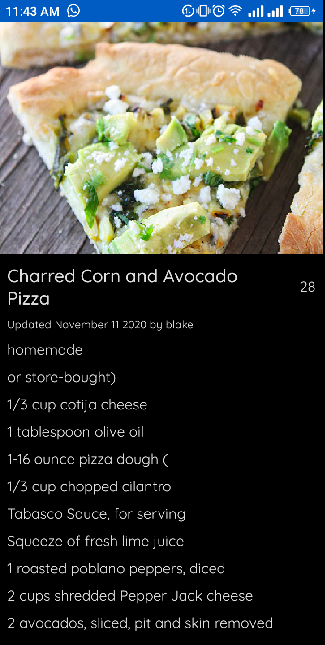

# Food Recipe App
Hey there! 👋🏼👋🏼👋🏼

This repository displays various food recipes and ingredients used to make them.
It was written entirely in Kotlin using Jetpack Compose.

#### Features:
- Jetpack Compose
- MVVM Architecture
- Asynchronous operations using Kotlin Coroutines
- Dependency Injection using Hilt
- Image loading and caching using Glide 
- API requests to server via Retrofit
- Animations and custom views

#### Prerequisite
To build this project, you require:

- Android Studio Canary version
- Gradle 7.0
- Kotlin 1.5.21
- Compose 1.0.1

#### Screenshots
- Loading Shimmer Animation

- Recipe List view

- Recipe Detail view

- Recipe List view (Dark mode)

- Recipe Detail view (Dark mode)
